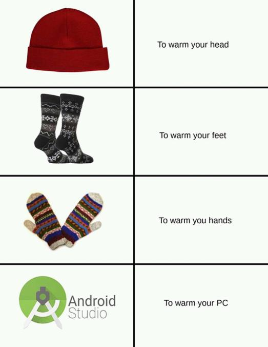

# *Hello There!* I'm Chi.

## About me
- University of California, San Diego
- Class of 2023
- Major in Computer Engineering

## Some projects I worked on:
- [Micromanager](https://github.com/cschow-ucsd/micromanager)
- [Base11-FC](https://github.com/cschow-ucsd/Base11-FC)
- [Lingua](https://github.com/cschow-ucsd/Lingua)

## My life goals
- [x] Go to college
- [ ] Be a good software engineer
- [x] Getting sleep
- [x] Not getting sleep
- [ ] ```git push --force ???```

## One of my favorites


> Android Studio warms your PC :)

## Last but not least
[Hehe](hehe.txt)